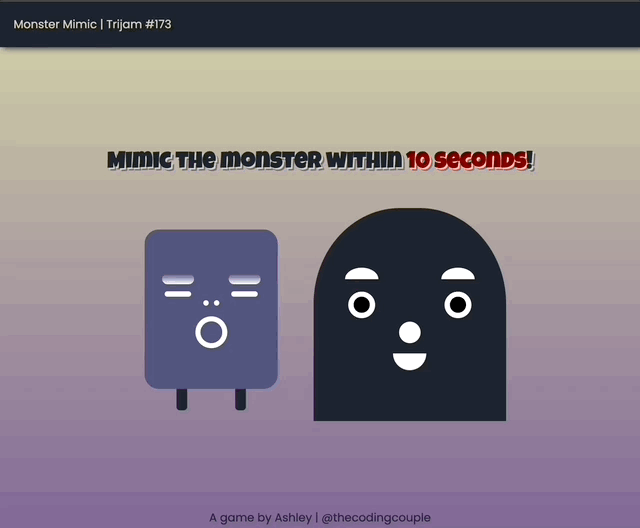

# trijam-173
Source code for Ashley's Trijam #173 entry. The theme is "You are the monster."

[Trijam](https://itch.io/jam/trijam-173) is a weekly game jam where the goal is to create a game in under 3 hours of development time. Monster Mimic was completed in about 8 hours of active development time.

## Synopsis

Monster Mimic is a speed and memory game. Players assume the role of a monster with the ability to mimic the appearance of monsters they encounter. 

The objective of the game is to accurately match the appearance of another monster within the finite amount of time.



## Built With

* Vanilla JS
* Visual Studio Code
* [Color Hunt Palette](https://colorhunt.co/palette/1b243051557e816797d6d5a8)

## Third Party Assets

* *Poppins* and *Luckiest Guy* Google Fonts
* Casual Funny Track (looped).wav (megamusiccollection)
* Blip_Select5.wav (megafxpack)
* SFX_Game_Celebration.wav (childrens_game_music)
* SFX_Fail.wav (childrens_game_music)

## Useful Resources

* [Draw a semi cirle with CSS](https://stackoverflow.com/questions/22415651/half-circle-with-css-border-outline-only)
* [Import Assertions](https://v8.dev/features/import-assertions)
* [Deep copy nodes](https://developer.mozilla.org/en-US/docs/Web/API/Document/importNode)


## Ideas for future improvements

???

## Project Setup

Run with local web server

```bash
python -m http.server 8000
```

or

```bash
python3 -m http.server 8000
```

## Maintainers

* [Ashley Grenon - @townsean](https://github.com/townsean)

## License (MIT)

MIT License

Copyright (c) 2022 Ashley Grenon

Permission is hereby granted, free of charge, to any person obtaining a copy of this software and associated documentation files (the "Software"), to deal in the Software without restriction, including without limitation the rights to use, copy, modify, merge, publish, distribute, sublicense, and/or sell copies of the Software, and to permit persons to whom the Software is furnished to do so, subject to the following conditions:

The above copyright notice and this permission notice shall be included in all copies or substantial portions of the Software.

THE SOFTWARE IS PROVIDED "AS IS", WITHOUT WARRANTY OF ANY KIND, EXPRESS OR IMPLIED, INCLUDING BUT NOT LIMITED TO THE WARRANTIES OF MERCHANTABILITY, FITNESS FOR A PARTICULAR PURPOSE AND NONINFRINGEMENT. IN NO EVENT SHALL THE AUTHORS OR COPYRIGHT HOLDERS BE LIABLE FOR ANY CLAIM, DAMAGES OR OTHER LIABILITY, WHETHER IN AN ACTION OF CONTRACT, TORT OR OTHERWISE, ARISING FROM, OUT OF OR IN CONNECTION WITH THE SOFTWARE OR THE USE OR OTHER DEALINGS IN THE SOFTWARE.
